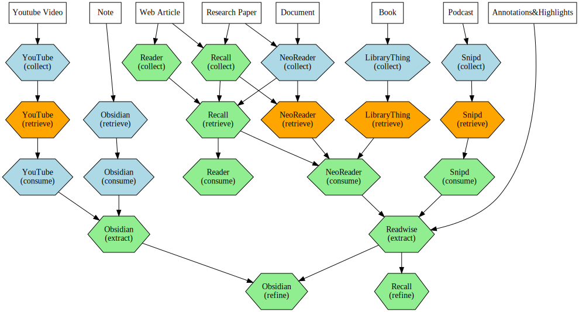

# Create graphiz visualisation


<!-- WARNING: THIS FILE WAS AUTOGENERATED! DO NOT EDIT! -->

The function to create the workflow visualisation for the given
`info_items` and `tools`. The function needs all available tools as
input and the `info_items` you want the visualisation for. It returns a
graphviz.Digraph object that can be rendered in Jupyter notebooks or
saved to a file. We will be using the SVG format for the
web-application.

------------------------------------------------------------------------

<a
href="https://github.com/Hopsakee/infoflow/blob/main/infoflow/viz.py#L14"
target="_blank" style="float:right; font-size:smaller">source</a>

### create_combined_infoflow_viz

>  create_combined_infoflow_viz (info_items, all_tools)

An example for creating the actual visualisation for the given
`info_items` and `tools`.

``` python
tools = [reader, recall, readwise, obsidian, librarything, snipd, neoreader, youtube]
items = [note_item, web_article_item, annotation_item, book_item, youtube_video_item, podcast_item, research_paper_item, document_item]
viz = create_combined_infoflow_viz(items, tools)
```

``` python
viz_document = create_combined_infoflow_viz([document_item], tools)

viz_document._repr_image_svg_xml()
```

    '<?xml version="1.0" encoding="UTF-8" standalone="no"?>\n<!DOCTYPE svg PUBLIC "-//W3C//DTD SVG 1.1//EN"\n "http://www.w3.org/Graphics/SVG/1.1/DTD/svg11.dtd">\n<!-- Generated by graphviz version 2.43.0 (0)\n -->\n<!-- Title: %3 Pages: 1 -->\n<svg width="226pt" height="534pt"\n viewBox="0.00 0.00 225.61 534.27" xmlns="http://www.w3.org/2000/svg" xmlns:xlink="http://www.w3.org/1999/xlink">\n<g id="graph0" class="graph" transform="scale(1 1) rotate(0) translate(4 530.27)">\n<title>%3</title>\n<polygon fill="white" stroke="transparent" points="-4,4 -4,-530.27 221.61,-530.27 221.61,4 -4,4"/>\n<!-- neoreader_collect -->\n<g id="node1" class="node">\n<title>neoreader_collect</title>\n<polygon fill="lightblue" stroke="black" points="174.81,-423.24 143.44,-454.3 80.7,-454.3 49.33,-423.24 80.7,-392.19 143.44,-392.19 174.81,-423.24"/>\n<text text-anchor="middle" x="112.07" y="-427.04" font-family="Times,serif" font-size="14.00">NeoReader</text>\n<text text-anchor="middle" x="112.07" y="-412.04" font-family="Times,serif" font-size="14.00">(collect)</text>\n</g>\n<!-- neoreader_retrieve -->\n<g id="node2" class="node">\n<title>neoreader_retrieve</title>\n<polygon fill="orange" stroke="black" points="174.81,-325.19 143.44,-356.24 80.7,-356.24 49.33,-325.19 80.7,-294.13 143.44,-294.13 174.81,-325.19"/>\n<text text-anchor="middle" x="112.07" y="-328.99" font-family="Times,serif" font-size="14.00">NeoReader</text>\n<text text-anchor="middle" x="112.07" y="-313.99" font-family="Times,serif" font-size="14.00">(retrieve)</text>\n</g>\n<!-- neoreader_collect&#45;&gt;neoreader_retrieve -->\n<g id="edge2" class="edge">\n<title>neoreader_collect&#45;&gt;neoreader_retrieve</title>\n<path fill="none" stroke="black" d="M112.07,-392.11C112.07,-384.06 112.07,-375.21 112.07,-366.7"/>\n<polygon fill="black" stroke="black" points="115.57,-366.54 112.07,-356.54 108.57,-366.54 115.57,-366.54"/>\n</g>\n<!-- neoreader_consume -->\n<g id="node3" class="node">\n<title>neoreader_consume</title>\n<polygon fill="lightgreen" stroke="black" points="174.81,-227.13 143.44,-258.19 80.7,-258.19 49.33,-227.13 80.7,-196.08 143.44,-196.08 174.81,-227.13"/>\n<text text-anchor="middle" x="112.07" y="-230.93" font-family="Times,serif" font-size="14.00">NeoReader</text>\n<text text-anchor="middle" x="112.07" y="-215.93" font-family="Times,serif" font-size="14.00">(consume)</text>\n</g>\n<!-- neoreader_retrieve&#45;&gt;neoreader_consume -->\n<g id="edge3" class="edge">\n<title>neoreader_retrieve&#45;&gt;neoreader_consume</title>\n<path fill="none" stroke="black" d="M112.07,-294.06C112.07,-286 112.07,-277.16 112.07,-268.64"/>\n<polygon fill="black" stroke="black" points="115.57,-268.49 112.07,-258.49 108.57,-268.49 115.57,-268.49"/>\n</g>\n<!-- readwise_extract -->\n<g id="node4" class="node">\n<title>readwise_extract</title>\n<polygon fill="lightgreen" stroke="black" points="168.25,-129.08 140.16,-160.13 83.98,-160.13 55.9,-129.08 83.98,-98.03 140.16,-98.03 168.25,-129.08"/>\n<text text-anchor="middle" x="112.07" y="-132.88" font-family="Times,serif" font-size="14.00">Readwise</text>\n<text text-anchor="middle" x="112.07" y="-117.88" font-family="Times,serif" font-size="14.00">(extract)</text>\n</g>\n<!-- neoreader_consume&#45;&gt;readwise_extract -->\n<g id="edge4" class="edge">\n<title>neoreader_consume&#45;&gt;readwise_extract</title>\n<path fill="none" stroke="black" d="M112.07,-196.01C112.07,-187.95 112.07,-179.11 112.07,-170.59"/>\n<polygon fill="black" stroke="black" points="115.57,-170.43 112.07,-160.43 108.57,-170.43 115.57,-170.43"/>\n</g>\n<!-- obsidian_refine -->\n<g id="node5" class="node">\n<title>obsidian_refine</title>\n<polygon fill="lightgreen" stroke="black" points="106.22,-31.03 79.64,-62.08 26.5,-62.08 -0.07,-31.03 26.5,0.03 79.64,0.03 106.22,-31.03"/>\n<text text-anchor="middle" x="53.07" y="-34.83" font-family="Times,serif" font-size="14.00">Obsidian</text>\n<text text-anchor="middle" x="53.07" y="-19.83" font-family="Times,serif" font-size="14.00">(refine)</text>\n</g>\n<!-- readwise_extract&#45;&gt;obsidian_refine -->\n<g id="edge5" class="edge">\n<title>readwise_extract&#45;&gt;obsidian_refine</title>\n<path fill="none" stroke="black" d="M93.57,-97.95C88.34,-89.45 82.59,-80.08 77.09,-71.13"/>\n<polygon fill="black" stroke="black" points="79.93,-69.07 71.72,-62.38 73.97,-72.73 79.93,-69.07"/>\n</g>\n<!-- recall_refine -->\n<g id="node6" class="node">\n<title>recall_refine</title>\n<polygon fill="lightgreen" stroke="black" points="217.65,-31.03 194.36,-62.08 147.78,-62.08 124.49,-31.03 147.78,0.03 194.36,0.03 217.65,-31.03"/>\n<text text-anchor="middle" x="171.07" y="-34.83" font-family="Times,serif" font-size="14.00">Recall</text>\n<text text-anchor="middle" x="171.07" y="-19.83" font-family="Times,serif" font-size="14.00">(refine)</text>\n</g>\n<!-- readwise_extract&#45;&gt;recall_refine -->\n<g id="edge6" class="edge">\n<title>readwise_extract&#45;&gt;recall_refine</title>\n<path fill="none" stroke="black" d="M130.58,-97.95C135.8,-89.45 141.56,-80.08 147.05,-71.13"/>\n<polygon fill="black" stroke="black" points="150.18,-72.73 152.43,-62.38 144.21,-69.07 150.18,-72.73"/>\n</g>\n<!-- source_document -->\n<g id="node7" class="node">\n<title>source_document</title>\n<polygon fill="none" stroke="black" points="149.07,-526.27 75.07,-526.27 75.07,-490.27 149.07,-490.27 149.07,-526.27"/>\n<text text-anchor="middle" x="112.07" y="-504.57" font-family="Times,serif" font-size="14.00">Document</text>\n</g>\n<!-- source_document&#45;&gt;neoreader_collect -->\n<g id="edge1" class="edge">\n<title>source_document&#45;&gt;neoreader_collect</title>\n<path fill="none" stroke="black" d="M112.07,-490.07C112.07,-482.61 112.07,-473.54 112.07,-464.55"/>\n<polygon fill="black" stroke="black" points="115.57,-464.52 112.07,-454.52 108.57,-464.52 115.57,-464.52"/>\n</g>\n</g>\n</svg>\n'

``` python
viz
```



``` python
type(viz)
```

    graphviz.graphs.Digraph

To get the `SVG` output, you can use the `_repr_image_svg_xml` method of
the `Digraph` object. Below is an example showing the first 200
characters.

``` python
viz._repr_image_svg_xml()[:200]
```

    '<?xml version="1.0" encoding="UTF-8" standalone="no"?>\n<!DOCTYPE svg PUBLIC "-//W3C//DTD SVG 1.1//EN"\n "http://www.w3.org/Graphics/SVG/1.1/DTD/svg11.dtd">\n<!-- Generated by graphviz version 2.43.0 (0)'
