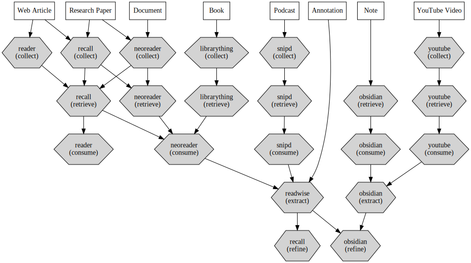
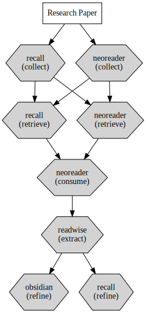
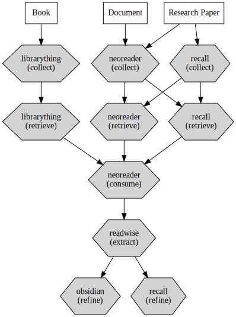

# Create graphiz visualisation


<!-- WARNING: THIS FILE WAS AUTOGENERATED! DO NOT EDIT! -->

## Creating some instances for testing

``` python
tools_from_code()
informationitems_from_code()
```

``` python
tools_inst = Tool.get_instances()
items_inst = InformationItem.get_instances()
```

``` python
tools_inst
```

    {'reader': Tool(name='Reader', organization_system=[<OrganizationSystem.TAGS: 'tags'>], phase_quality=PhaseQualityData(collect=<PhaseQuality.GREAT: 'great'>, retrieve=<PhaseQuality.BAD: 'bad'>, consume=<PhaseQuality.GREAT: 'great'>, extract=<PhaseQuality.NA: 'na'>, refine=<PhaseQuality.NA: 'na'>), collect=None, retrieve=None, consume=None, extract=None, refine=None, slug='reader'),
     'recall': Tool(name='Recall', organization_system=[<OrganizationSystem.LINKS: 'links'>], phase_quality=PhaseQualityData(collect=<PhaseQuality.GREAT: 'great'>, retrieve=<PhaseQuality.GREAT: 'great'>, consume=<PhaseQuality.NA: 'na'>, extract=<PhaseQuality.NA: 'na'>, refine=<PhaseQuality.GREAT: 'great'>), collect=None, retrieve=None, consume=None, extract=None, refine=None, slug='recall'),
     'readwise': Tool(name='Readwise', organization_system=[<OrganizationSystem.TAGS: 'tags'>], phase_quality=PhaseQualityData(collect=<PhaseQuality.NA: 'na'>, retrieve=<PhaseQuality.OK: 'ok'>, consume=<PhaseQuality.NA: 'na'>, extract=<PhaseQuality.GREAT: 'great'>, refine=<PhaseQuality.OK: 'ok'>), collect=None, retrieve=None, consume=None, extract=None, refine=None, slug='readwise'),
     'obsidian': Tool(name='Obsidian', organization_system=[<OrganizationSystem.JOHNNY_DECIMAL: 'johnny_decimal'>, <OrganizationSystem.LINKS: 'links'>], phase_quality=PhaseQualityData(collect=<PhaseQuality.NA: 'na'>, retrieve=<PhaseQuality.OK: 'ok'>, consume=<PhaseQuality.OK: 'ok'>, extract=<PhaseQuality.GREAT: 'great'>, refine=<PhaseQuality.GREAT: 'great'>), collect=None, retrieve=None, consume=None, extract=None, refine=None, slug='obsidian'),
     'librarything': Tool(name='LibraryThing', organization_system=[<OrganizationSystem.TAGS: 'tags'>], phase_quality=PhaseQualityData(collect=<PhaseQuality.OK: 'ok'>, retrieve=<PhaseQuality.BAD: 'bad'>, consume=<PhaseQuality.NA: 'na'>, extract=<PhaseQuality.NA: 'na'>, refine=<PhaseQuality.NA: 'na'>), collect=None, retrieve=None, consume=None, extract=None, refine=None, slug='librarything'),
     'snipd': Tool(name='Snipd', organization_system=[<OrganizationSystem.FOLDERS: 'folders'>], phase_quality=PhaseQualityData(collect=<PhaseQuality.OK: 'ok'>, retrieve=<PhaseQuality.BAD: 'bad'>, consume=<PhaseQuality.GREAT: 'great'>, extract=<PhaseQuality.NA: 'na'>, refine=<PhaseQuality.NA: 'na'>), collect=None, retrieve=None, consume=None, extract=None, refine=None, slug='snipd'),
     'neoreader': Tool(name='NeoReader', organization_system=[<OrganizationSystem.FOLDERS: 'folders'>], phase_quality=PhaseQualityData(collect=<PhaseQuality.OK: 'ok'>, retrieve=<PhaseQuality.BAD: 'bad'>, consume=<PhaseQuality.GREAT: 'great'>, extract=<PhaseQuality.NA: 'na'>, refine=<PhaseQuality.NA: 'na'>), collect=None, retrieve=None, consume=None, extract=None, refine=None, slug='neoreader'),
     'youtube': Tool(name='YouTube', organization_system=[<OrganizationSystem.FOLDERS: 'folders'>], phase_quality=PhaseQualityData(collect=<PhaseQuality.OK: 'ok'>, retrieve=<PhaseQuality.BAD: 'bad'>, consume=<PhaseQuality.OK: 'ok'>, extract=<PhaseQuality.NA: 'na'>, refine=<PhaseQuality.NA: 'na'>), collect=None, retrieve=None, consume=None, extract=None, refine=None, slug='youtube')}

``` python
test_eq(len(items_inst), 8)
test(tools_inst, "reader", operator.contains)
```

## Helper functions

The function `get_items_for_tool` filters all the instances of the class
InformationItem based on which information items can be processed by the
given tool.

------------------------------------------------------------------------

<a
href="https://github.com/Hopsakee/infoflow/blob/main/infoflow/viz.py#L17"
target="_blank" style="float:right; font-size:smaller">source</a>

### get_info_items_for_tool

>  get_info_items_for_tool (tool_name:str,
>                               info_items:dict[infoflow.classdb.InformationItem
>                               ])

*Filters all the instances of the class InformationItem based on which
information items can be processed by the given tool.*

Test the
[`get_info_items_for_tool`](https://Hopsakee.github.io/infoflow/create_vizualisation.html#get_info_items_for_tool)
function.

``` python
get_info_items_for_tool('reader', items_inst)
```

    info_items: dict_values([InformationItem(name='Web Article', info_type=<InformationType.WEB_ARTICLE: 'web_article'>, method=PhaseMethodData(collect=<Method.MANUAL: 'manual'>, retrieve=None, consume=None, extract=None, refine=None), toolflow=PhaseToolflowData(collect=('reader', 'recall'), retrieve='recall', consume='reader', extract=None, refine=None), slug='web_article'), InformationItem(name='Annotation', info_type=<InformationType.ANNOTATION: 'annotations&highlights'>, method=PhaseMethodData(collect=<Method.AUTOMATIC: 'automatic'>, retrieve=None, consume=None, extract=None, refine=None), toolflow=PhaseToolflowData(collect=None, retrieve=None, consume=None, extract='readwise', refine=('recall', 'obsidian')), slug='annotation'), InformationItem(name='Note', info_type=<InformationType.NOTE: 'note'>, method=PhaseMethodData(collect=<Method.MANUAL: 'manual'>, retrieve=None, consume=None, extract=None, refine=None), toolflow=PhaseToolflowData(collect=None, retrieve='obsidian', consume='obsidian', extract='obsidian', refine='obsidian'), slug='note'), InformationItem(name='Book', info_type=<InformationType.BOOK: 'book'>, method=PhaseMethodData(collect=<Method.MANUAL: 'manual'>, retrieve=None, consume=None, extract=None, refine=None), toolflow=PhaseToolflowData(collect='librarything', retrieve='librarything', consume='neoreader', extract='readwise', refine='obsidian'), slug='book'), InformationItem(name='Podcast', info_type=<InformationType.PODCAST: 'podcast'>, method=PhaseMethodData(collect=<Method.AUTOMATIC: 'automatic'>, retrieve=None, consume=None, extract=None, refine=None), toolflow=PhaseToolflowData(collect='snipd', retrieve='snipd', consume='snipd', extract='readwise', refine='obsidian'), slug='podcast'), InformationItem(name='Research Paper', info_type=<InformationType.RESEARCH_PAPER: 'research_paper'>, method=PhaseMethodData(collect=<Method.MANUAL: 'manual'>, retrieve=None, consume=None, extract=None, refine=None), toolflow=PhaseToolflowData(collect=('recall', 'neoreader'), retrieve=('recall', 'neoreader'), consume='neoreader', extract='readwise', refine=('obsidian', 'recall')), slug='research_paper'), InformationItem(name='Document', info_type=<InformationType.DOCUMENT: 'document'>, method=PhaseMethodData(collect=<Method.MANUAL: 'manual'>, retrieve=None, consume=None, extract=None, refine=None), toolflow=PhaseToolflowData(collect='neoreader', retrieve='neoreader', consume='neoreader', extract='readwise', refine=('obsidian', 'recall')), slug='document'), InformationItem(name='YouTube Video', info_type=<InformationType.YOUTUBE_VIDEO: 'youtube_video'>, method=PhaseMethodData(collect=<Method.AUTOMATIC: 'automatic'>, retrieve=None, consume=None, extract=None, refine=None), toolflow=PhaseToolflowData(collect='youtube', retrieve='youtube', consume='youtube', extract='obsidian', refine='obsidian'), slug='youtube_video')])
    info_item: name='Web Article' info_type=<InformationType.WEB_ARTICLE: 'web_article'> method=PhaseMethodData(collect=<Method.MANUAL: 'manual'>, retrieve=None, consume=None, extract=None, refine=None) toolflow=PhaseToolflowData(collect=('reader', 'recall'), retrieve='recall', consume='reader', extract=None, refine=None) slug='web_article'
    toolflow: collect=('reader', 'recall') retrieve='recall' consume='reader' extract=None refine=None
    phase: collect
    tools: ('reader', 'recall')
    ts is list: ('reader', 'recall')
    info_item: name='Annotation' info_type=<InformationType.ANNOTATION: 'annotations&highlights'> method=PhaseMethodData(collect=<Method.AUTOMATIC: 'automatic'>, retrieve=None, consume=None, extract=None, refine=None) toolflow=PhaseToolflowData(collect=None, retrieve=None, consume=None, extract='readwise', refine=('recall', 'obsidian')) slug='annotation'
    toolflow: collect=None retrieve=None consume=None extract='readwise' refine=('recall', 'obsidian')
    phase: collect
    tools: None
    phase: retrieve
    tools: None
    phase: consume
    tools: None
    phase: extract
    tools: readwise
    phase: refine
    tools: ('recall', 'obsidian')
    ts is list: ('recall', 'obsidian')
    info_item: name='Note' info_type=<InformationType.NOTE: 'note'> method=PhaseMethodData(collect=<Method.MANUAL: 'manual'>, retrieve=None, consume=None, extract=None, refine=None) toolflow=PhaseToolflowData(collect=None, retrieve='obsidian', consume='obsidian', extract='obsidian', refine='obsidian') slug='note'
    toolflow: collect=None retrieve='obsidian' consume='obsidian' extract='obsidian' refine='obsidian'
    phase: collect
    tools: None
    phase: retrieve
    tools: obsidian
    phase: consume
    tools: obsidian
    phase: extract
    tools: obsidian
    phase: refine
    tools: obsidian
    info_item: name='Book' info_type=<InformationType.BOOK: 'book'> method=PhaseMethodData(collect=<Method.MANUAL: 'manual'>, retrieve=None, consume=None, extract=None, refine=None) toolflow=PhaseToolflowData(collect='librarything', retrieve='librarything', consume='neoreader', extract='readwise', refine='obsidian') slug='book'
    toolflow: collect='librarything' retrieve='librarything' consume='neoreader' extract='readwise' refine='obsidian'
    phase: collect
    tools: librarything
    phase: retrieve
    tools: librarything
    phase: consume
    tools: neoreader
    phase: extract
    tools: readwise
    phase: refine
    tools: obsidian
    info_item: name='Podcast' info_type=<InformationType.PODCAST: 'podcast'> method=PhaseMethodData(collect=<Method.AUTOMATIC: 'automatic'>, retrieve=None, consume=None, extract=None, refine=None) toolflow=PhaseToolflowData(collect='snipd', retrieve='snipd', consume='snipd', extract='readwise', refine='obsidian') slug='podcast'
    toolflow: collect='snipd' retrieve='snipd' consume='snipd' extract='readwise' refine='obsidian'
    phase: collect
    tools: snipd
    phase: retrieve
    tools: snipd
    phase: consume
    tools: snipd
    phase: extract
    tools: readwise
    phase: refine
    tools: obsidian
    info_item: name='Research Paper' info_type=<InformationType.RESEARCH_PAPER: 'research_paper'> method=PhaseMethodData(collect=<Method.MANUAL: 'manual'>, retrieve=None, consume=None, extract=None, refine=None) toolflow=PhaseToolflowData(collect=('recall', 'neoreader'), retrieve=('recall', 'neoreader'), consume='neoreader', extract='readwise', refine=('obsidian', 'recall')) slug='research_paper'
    toolflow: collect=('recall', 'neoreader') retrieve=('recall', 'neoreader') consume='neoreader' extract='readwise' refine=('obsidian', 'recall')
    phase: collect
    tools: ('recall', 'neoreader')
    ts is list: ('recall', 'neoreader')
    phase: retrieve
    tools: ('recall', 'neoreader')
    ts is list: ('recall', 'neoreader')
    phase: consume
    tools: neoreader
    phase: extract
    tools: readwise
    phase: refine
    tools: ('obsidian', 'recall')
    ts is list: ('obsidian', 'recall')
    info_item: name='Document' info_type=<InformationType.DOCUMENT: 'document'> method=PhaseMethodData(collect=<Method.MANUAL: 'manual'>, retrieve=None, consume=None, extract=None, refine=None) toolflow=PhaseToolflowData(collect='neoreader', retrieve='neoreader', consume='neoreader', extract='readwise', refine=('obsidian', 'recall')) slug='document'
    toolflow: collect='neoreader' retrieve='neoreader' consume='neoreader' extract='readwise' refine=('obsidian', 'recall')
    phase: collect
    tools: neoreader
    phase: retrieve
    tools: neoreader
    phase: consume
    tools: neoreader
    phase: extract
    tools: readwise
    phase: refine
    tools: ('obsidian', 'recall')
    ts is list: ('obsidian', 'recall')
    info_item: name='YouTube Video' info_type=<InformationType.YOUTUBE_VIDEO: 'youtube_video'> method=PhaseMethodData(collect=<Method.AUTOMATIC: 'automatic'>, retrieve=None, consume=None, extract=None, refine=None) toolflow=PhaseToolflowData(collect='youtube', retrieve='youtube', consume='youtube', extract='obsidian', refine='obsidian') slug='youtube_video'
    toolflow: collect='youtube' retrieve='youtube' consume='youtube' extract='obsidian' refine='obsidian'
    phase: collect
    tools: youtube
    phase: retrieve
    tools: youtube
    phase: consume
    tools: youtube
    phase: extract
    tools: obsidian
    phase: refine
    tools: obsidian

    {'Web Article': InformationItem(name='Web Article', info_type=<InformationType.WEB_ARTICLE: 'web_article'>, method=PhaseMethodData(collect=<Method.MANUAL: 'manual'>, retrieve=None, consume=None, extract=None, refine=None), toolflow=PhaseToolflowData(collect=('reader', 'recall'), retrieve='recall', consume='reader', extract=None, refine=None), slug='web_article')}

## Graphiz visualisation

The function to create the workflow visualisation for the given
`info_items` and `tools`. This is done in two steps. First we use the
function
[`create_workflow_viz`](https://Hopsakee.github.io/infoflow/create_vizualisation.html#create_workflow_viz)
that functions as a wrapper around the
[`build_graphiz_from_instances`](https://Hopsakee.github.io/infoflow/create_vizualisation.html#build_graphiz_from_instances)
function.

The
[`create_workflow_viz`](https://Hopsakee.github.io/infoflow/create_vizualisation.html#create_workflow_viz)
has two tasks:

- It makes calling the
  [`build_graphiz_from_instances`](https://Hopsakee.github.io/infoflow/create_vizualisation.html#build_graphiz_from_instances)
  function easier by assuming we want to use all instances from the
  [`Tool`](https://Hopsakee.github.io/infoflow/classes_db.html#tool) and
  [`InformationItem`](https://Hopsakee.github.io/infoflow/classes_db.html#informationitem)
  classes. If we want to use a single instance, we can pass a single
  instance of
  [`Tool`](https://Hopsakee.github.io/infoflow/classes_db.html#tool) or
  [`InformationItem`](https://Hopsakee.github.io/infoflow/classes_db.html#informationitem).
  If we want several, but not all, instances of
  [`Tool`](https://Hopsakee.github.io/infoflow/classes_db.html#tool) or
  [`InformationItem`](https://Hopsakee.github.io/infoflow/classes_db.html#informationitem),
  we can pass a dict of instances.
- It adds the option to filter the graph to be created on a single
  [`Tool`](https://Hopsakee.github.io/infoflow/classes_db.html#tool)-name.
  If the parameter `tool_filter` is used, the function calls the
  [`get_info_items_for_tool`](https://Hopsakee.github.io/infoflow/create_vizualisation.html#get_info_items_for_tool)
  function and filters the needed
  [`InformationItem`](https://Hopsakee.github.io/infoflow/classes_db.html#informationitem)
  instances based on that tool. This way only those parts of the graph
  will be drawn that we want to see.

------------------------------------------------------------------------

<a
href="https://github.com/Hopsakee/infoflow/blob/main/infoflow/viz.py#L44"
target="_blank" style="float:right; font-size:smaller">source</a>

### build_graphiz_from_instances

>  build_graphiz_from_instances
>                                    (info_items:dict[infoflow.classdb.Informati
>                                    onItem], tools:dict[infoflow.classdb.Tool])

*Create a graphviz visualisation based on the instances of the
InformationItem class and their flow through the instances of the Tool
class.*

------------------------------------------------------------------------

<a
href="https://github.com/Hopsakee/infoflow/blob/main/infoflow/viz.py#L113"
target="_blank" style="float:right; font-size:smaller">source</a>

### build_graphiz_from_intances_new

>  build_graphiz_from_intances_new (info_items, tools)

*Create a graphviz visualisation using the updated dataclasses for
InformationItem and Tool. Produces the same layout as
build_graphiz_from_instances.*

------------------------------------------------------------------------

<a
href="https://github.com/Hopsakee/infoflow/blob/main/infoflow/viz.py#L182"
target="_blank" style="float:right; font-size:smaller">source</a>

### create_workflow_viz

>  create_workflow_viz (items:None|infoflow.classdb.InformationItem|dict[str
>                           ,infoflow.classdb.InformationItem]=None, tools:None|
>                           infoflow.classdb.Tool|dict[str,infoflow.classdb.Tool
>                           ]=None, tool_filter:None|str=None)

*Create workflow visualization with flexible filtering options.*

------------------------------------------------------------------------

<a
href="https://github.com/Hopsakee/infoflow/blob/main/infoflow/viz.py#L197"
target="_blank" style="float:right; font-size:smaller">source</a>

### create_workflow_viz_new

>  create_workflow_viz_new (items:None|infoflow.classdb.InformationItem|dict
>                               [str,infoflow.classdb.InformationItem]=None, too
>                               ls:None|infoflow.classdb.Tool|dict[str,infoflow.
>                               classdb.Tool]=None, tool_filter:None|str=None)

*Create workflow visualization with flexible filtering options.*

An example for creating the actual visualisation for the given
`info_items` and `tools`.

``` python
viz = create_workflow_viz(items_inst, tools_inst)
type(viz)
```

    TypeError: object of type 'PhaseToolflowData' has no len()
    ---------------------------------------------------------------------------
    TypeError                                 Traceback (most recent call last)
    Cell In[13], line 1
    ----> 1 viz = create_workflow_viz(items_inst, tools_inst)
          2 type(viz)

    Cell In[11], line 14, in create_workflow_viz(items, tools, tool_filter)
         11 if tool_filter:
         12     items = get_info_items_for_tool(tool_filter, items)
    ---> 14 return build_graphiz_from_instances(items, tools)

    Cell In[9], line 22, in build_graphiz_from_instances(info_items, tools)
         20 for info_item in info_items:
         21     i = phases.index(phase)
    ---> 22     if i < len(info_item.toolflow) and info_item.toolflow[i] is not None:
         23         tool_entry = info_item.toolflow[i]
         24         if isinstance(tool_entry, (list, tuple)): tools_in_phase = tool_entry

    TypeError: object of type 'PhaseToolflowData' has no len()

``` python
viz = create_workflow_viz_new(items_inst, tools_inst)
type(viz)
```

    graphviz.graphs.Digraph

``` python
viz
```



``` python
viz_document = create_workflow_viz_new(items_inst['research_paper'])
viz_document
```



``` python
viz_tool = create_workflow_viz_new(tool_filter='neoreader')
viz_tool
```

    info_items: dict_values([InformationItem(name='Web Article', info_type=<InformationType.WEB_ARTICLE: 'web_article'>, method=PhaseMethodData(collect=<Method.MANUAL: 'manual'>, retrieve=None, consume=None, extract=None, refine=None), toolflow=PhaseToolflowData(collect=('reader', 'recall'), retrieve='recall', consume='reader', extract=None, refine=None), slug='web_article'), InformationItem(name='Annotation', info_type=<InformationType.ANNOTATION: 'annotations&highlights'>, method=PhaseMethodData(collect=<Method.AUTOMATIC: 'automatic'>, retrieve=None, consume=None, extract=None, refine=None), toolflow=PhaseToolflowData(collect=None, retrieve=None, consume=None, extract='readwise', refine=('recall', 'obsidian')), slug='annotation'), InformationItem(name='Note', info_type=<InformationType.NOTE: 'note'>, method=PhaseMethodData(collect=<Method.MANUAL: 'manual'>, retrieve=None, consume=None, extract=None, refine=None), toolflow=PhaseToolflowData(collect=None, retrieve='obsidian', consume='obsidian', extract='obsidian', refine='obsidian'), slug='note'), InformationItem(name='Book', info_type=<InformationType.BOOK: 'book'>, method=PhaseMethodData(collect=<Method.MANUAL: 'manual'>, retrieve=None, consume=None, extract=None, refine=None), toolflow=PhaseToolflowData(collect='librarything', retrieve='librarything', consume='neoreader', extract='readwise', refine='obsidian'), slug='book'), InformationItem(name='Podcast', info_type=<InformationType.PODCAST: 'podcast'>, method=PhaseMethodData(collect=<Method.AUTOMATIC: 'automatic'>, retrieve=None, consume=None, extract=None, refine=None), toolflow=PhaseToolflowData(collect='snipd', retrieve='snipd', consume='snipd', extract='readwise', refine='obsidian'), slug='podcast'), InformationItem(name='Research Paper', info_type=<InformationType.RESEARCH_PAPER: 'research_paper'>, method=PhaseMethodData(collect=<Method.MANUAL: 'manual'>, retrieve=None, consume=None, extract=None, refine=None), toolflow=PhaseToolflowData(collect=('recall', 'neoreader'), retrieve=('recall', 'neoreader'), consume='neoreader', extract='readwise', refine=('obsidian', 'recall')), slug='research_paper'), InformationItem(name='Document', info_type=<InformationType.DOCUMENT: 'document'>, method=PhaseMethodData(collect=<Method.MANUAL: 'manual'>, retrieve=None, consume=None, extract=None, refine=None), toolflow=PhaseToolflowData(collect='neoreader', retrieve='neoreader', consume='neoreader', extract='readwise', refine=('obsidian', 'recall')), slug='document'), InformationItem(name='YouTube Video', info_type=<InformationType.YOUTUBE_VIDEO: 'youtube_video'>, method=PhaseMethodData(collect=<Method.AUTOMATIC: 'automatic'>, retrieve=None, consume=None, extract=None, refine=None), toolflow=PhaseToolflowData(collect='youtube', retrieve='youtube', consume='youtube', extract='obsidian', refine='obsidian'), slug='youtube_video')])
    info_item: name='Web Article' info_type=<InformationType.WEB_ARTICLE: 'web_article'> method=PhaseMethodData(collect=<Method.MANUAL: 'manual'>, retrieve=None, consume=None, extract=None, refine=None) toolflow=PhaseToolflowData(collect=('reader', 'recall'), retrieve='recall', consume='reader', extract=None, refine=None) slug='web_article'
    toolflow: collect=('reader', 'recall') retrieve='recall' consume='reader' extract=None refine=None
    phase: collect
    tools: ('reader', 'recall')
    ts is list: ('reader', 'recall')
    phase: retrieve
    tools: recall
    phase: consume
    tools: reader
    phase: extract
    tools: None
    phase: refine
    tools: None
    info_item: name='Annotation' info_type=<InformationType.ANNOTATION: 'annotations&highlights'> method=PhaseMethodData(collect=<Method.AUTOMATIC: 'automatic'>, retrieve=None, consume=None, extract=None, refine=None) toolflow=PhaseToolflowData(collect=None, retrieve=None, consume=None, extract='readwise', refine=('recall', 'obsidian')) slug='annotation'
    toolflow: collect=None retrieve=None consume=None extract='readwise' refine=('recall', 'obsidian')
    phase: collect
    tools: None
    phase: retrieve
    tools: None
    phase: consume
    tools: None
    phase: extract
    tools: readwise
    phase: refine
    tools: ('recall', 'obsidian')
    ts is list: ('recall', 'obsidian')
    info_item: name='Note' info_type=<InformationType.NOTE: 'note'> method=PhaseMethodData(collect=<Method.MANUAL: 'manual'>, retrieve=None, consume=None, extract=None, refine=None) toolflow=PhaseToolflowData(collect=None, retrieve='obsidian', consume='obsidian', extract='obsidian', refine='obsidian') slug='note'
    toolflow: collect=None retrieve='obsidian' consume='obsidian' extract='obsidian' refine='obsidian'
    phase: collect
    tools: None
    phase: retrieve
    tools: obsidian
    phase: consume
    tools: obsidian
    phase: extract
    tools: obsidian
    phase: refine
    tools: obsidian
    info_item: name='Book' info_type=<InformationType.BOOK: 'book'> method=PhaseMethodData(collect=<Method.MANUAL: 'manual'>, retrieve=None, consume=None, extract=None, refine=None) toolflow=PhaseToolflowData(collect='librarything', retrieve='librarything', consume='neoreader', extract='readwise', refine='obsidian') slug='book'
    toolflow: collect='librarything' retrieve='librarything' consume='neoreader' extract='readwise' refine='obsidian'
    phase: collect
    tools: librarything
    phase: retrieve
    tools: librarything
    phase: consume
    tools: neoreader
    info_item: name='Podcast' info_type=<InformationType.PODCAST: 'podcast'> method=PhaseMethodData(collect=<Method.AUTOMATIC: 'automatic'>, retrieve=None, consume=None, extract=None, refine=None) toolflow=PhaseToolflowData(collect='snipd', retrieve='snipd', consume='snipd', extract='readwise', refine='obsidian') slug='podcast'
    toolflow: collect='snipd' retrieve='snipd' consume='snipd' extract='readwise' refine='obsidian'
    phase: collect
    tools: snipd
    phase: retrieve
    tools: snipd
    phase: consume
    tools: snipd
    phase: extract
    tools: readwise
    phase: refine
    tools: obsidian
    info_item: name='Research Paper' info_type=<InformationType.RESEARCH_PAPER: 'research_paper'> method=PhaseMethodData(collect=<Method.MANUAL: 'manual'>, retrieve=None, consume=None, extract=None, refine=None) toolflow=PhaseToolflowData(collect=('recall', 'neoreader'), retrieve=('recall', 'neoreader'), consume='neoreader', extract='readwise', refine=('obsidian', 'recall')) slug='research_paper'
    toolflow: collect=('recall', 'neoreader') retrieve=('recall', 'neoreader') consume='neoreader' extract='readwise' refine=('obsidian', 'recall')
    phase: collect
    tools: ('recall', 'neoreader')
    ts is list: ('recall', 'neoreader')
    info_item: name='Document' info_type=<InformationType.DOCUMENT: 'document'> method=PhaseMethodData(collect=<Method.MANUAL: 'manual'>, retrieve=None, consume=None, extract=None, refine=None) toolflow=PhaseToolflowData(collect='neoreader', retrieve='neoreader', consume='neoreader', extract='readwise', refine=('obsidian', 'recall')) slug='document'
    toolflow: collect='neoreader' retrieve='neoreader' consume='neoreader' extract='readwise' refine=('obsidian', 'recall')
    phase: collect
    tools: neoreader
    info_item: name='YouTube Video' info_type=<InformationType.YOUTUBE_VIDEO: 'youtube_video'> method=PhaseMethodData(collect=<Method.AUTOMATIC: 'automatic'>, retrieve=None, consume=None, extract=None, refine=None) toolflow=PhaseToolflowData(collect='youtube', retrieve='youtube', consume='youtube', extract='obsidian', refine='obsidian') slug='youtube_video'
    toolflow: collect='youtube' retrieve='youtube' consume='youtube' extract='obsidian' refine='obsidian'
    phase: collect
    tools: youtube
    phase: retrieve
    tools: youtube
    phase: consume
    tools: youtube
    phase: extract
    tools: obsidian
    phase: refine
    tools: obsidian



To get the `SVG` output, you can use the `_repr_image_svg_xml` method of
the `Digraph` object. Below is an example showing the first 200
characters.

``` python
viz._repr_image_svg_xml()[:200]
```

    '<?xml version="1.0" encoding="UTF-8" standalone="no"?>\n<!DOCTYPE svg PUBLIC "-//W3C//DTD SVG 1.1//EN"\n "http://www.w3.org/Graphics/SVG/1.1/DTD/svg11.dtd">\n<!-- Generated by graphviz version 2.43.0 (0)'
