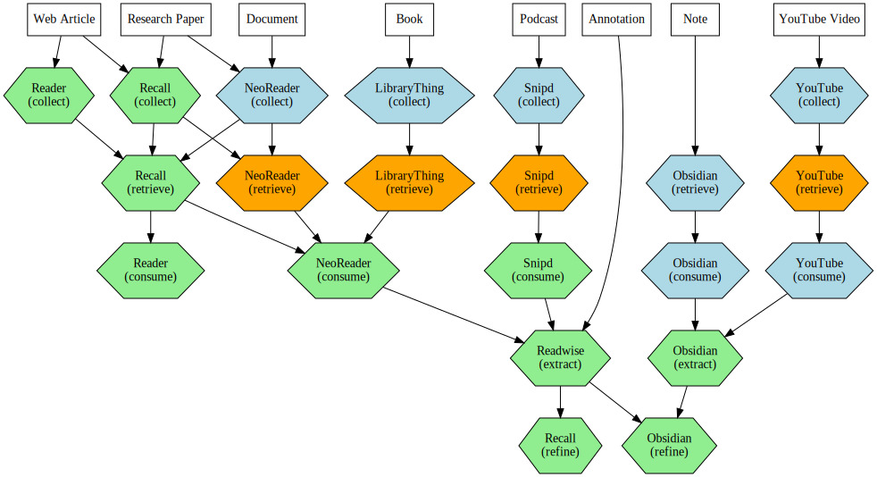
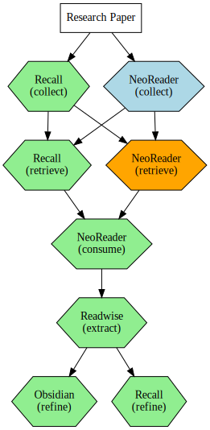
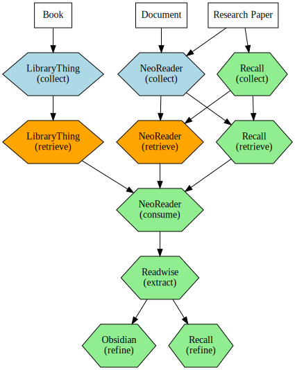

# Create graphiz visualisation


<!-- WARNING: THIS FILE WAS AUTOGENERATED! DO NOT EDIT! -->

## Helper functions

The function `get_items_for_tool` filters all the instances of the class
InformationItem based on which information items can be processed by the
given tool.

------------------------------------------------------------------------

<a
href="https://github.com/Hopsakee/infoflow/blob/main/infoflow/viz.py#L14"
target="_blank" style="float:right; font-size:smaller">source</a>

### get_info_items_for_tool

>  get_info_items_for_tool (tool_name:str,
>                               info_items:dict[infoflow.classdb.InformationItem
>                               ])

*Filters all the instances of the class InformationItem based on which
information items can be processed by the given tool.*

## Graphiz visualisation

The function to create the workflow visualisation for the given
`info_items` and `tools`. This is done in two steps. First we use the
function
[`create_workflow_viz`](https://Hopsakee.github.io/infoflow/create_vizualisation.html#create_workflow_viz)
that functions as a wrapper around the
[`build_graphiz_from_instances`](https://Hopsakee.github.io/infoflow/create_vizualisation.html#build_graphiz_from_instances)
function.

The
[`create_workflow_viz`](https://Hopsakee.github.io/infoflow/create_vizualisation.html#create_workflow_viz)
has two tasks:

- It makes calling the
  [`build_graphiz_from_instances`](https://Hopsakee.github.io/infoflow/create_vizualisation.html#build_graphiz_from_instances)
  function easier by assuming we want to use all instances from the
  [`Tool`](https://Hopsakee.github.io/infoflow/classes_db.html#tool) and
  [`InformationItem`](https://Hopsakee.github.io/infoflow/classes_db.html#informationitem)
  classes. If we want to use a single instance, we can pass a single
  instance of
  [`Tool`](https://Hopsakee.github.io/infoflow/classes_db.html#tool) or
  [`InformationItem`](https://Hopsakee.github.io/infoflow/classes_db.html#informationitem).
  If we want several, but not all, instances of
  [`Tool`](https://Hopsakee.github.io/infoflow/classes_db.html#tool) or
  [`InformationItem`](https://Hopsakee.github.io/infoflow/classes_db.html#informationitem),
  we can pass a dict of instances.
- It adds the option to filter the graph to be created on a single
  [`Tool`](https://Hopsakee.github.io/infoflow/classes_db.html#tool)-name.
  If the parameter `tool_filter` is used, the function calls the
  [`get_info_items_for_tool`](https://Hopsakee.github.io/infoflow/create_vizualisation.html#get_info_items_for_tool)
  function and filters the needed
  [`InformationItem`](https://Hopsakee.github.io/infoflow/classes_db.html#informationitem)
  instances based on that tool. This way only those parts of the graph
  will be drawn that we want to see.

------------------------------------------------------------------------

<a
href="https://github.com/Hopsakee/infoflow/blob/main/infoflow/viz.py#L33"
target="_blank" style="float:right; font-size:smaller">source</a>

### build_graphiz_from_instances

>  build_graphiz_from_instances
>                                    (info_items:dict[infoflow.classdb.Informati
>                                    onItem], tools:dict[infoflow.classdb.Tool])

*Create a graphviz visualisation based on the instances of the
InformationItem class and their flow through the instances of the Tool
class.*

------------------------------------------------------------------------

<a
href="https://github.com/Hopsakee/infoflow/blob/main/infoflow/viz.py#L101"
target="_blank" style="float:right; font-size:smaller">source</a>

### create_workflow_viz

>  create_workflow_viz (items:None|infoflow.classdb.InformationItem|dict[str
>                           ,infoflow.classdb.InformationItem]=None, tools:None|
>                           infoflow.classdb.Tool|dict[str,infoflow.classdb.Tool
>                           ]=None, tool_filter:None|str=None)

*Create workflow visualization with flexible filtering options.*

An example for creating the actual visualisation for the given
`info_items` and `tools`.

``` python
# tools = [reader, recall, readwise, obsidian, librarything, snipd, neoreader, youtube]
# items = [note_item, web_article_item, annotation_item, book_item, youtube_video_item, podcast_item, research_paper_item, document_item]
tools_from_code()
informationitems_from_code()
```

``` python
tools_inst = Tool.get_instances()
items_inst = InformationItem.get_instances()
```

``` python
items_inst
```

    {'Web Article': InformationItem(name='Web Article', info_type=<InformationType.WEB_ARTICLE: 'web_article'>, method=[<Method.MANUAL: 'manual'>, None, None, None, None], toolflow=[['Reader', 'Recall'], 'Recall', 'Reader', None, None]),
     'Annotation': InformationItem(name='Annotation', info_type=<InformationType.ANNOTATION: 'annotations&highlights'>, method=[<Method.AUTOMATIC: 'automatic'>, None, None, None, None], toolflow=[None, None, None, 'Readwise', ['Recall', 'Obsidian']]),
     'Note': InformationItem(name='Note', info_type=<InformationType.NOTE: 'note'>, method=[<Method.MANUAL: 'manual'>, None, None, None, None], toolflow=[None, 'Obsidian', 'Obsidian', 'Obsidian', 'Obsidian']),
     'Book': InformationItem(name='Book', info_type=<InformationType.BOOK: 'book'>, method=[<Method.MANUAL: 'manual'>, None, None, None, None], toolflow=['LibraryThing', 'LibraryThing', 'NeoReader', 'Readwise', 'Obsidian']),
     'Podcast': InformationItem(name='Podcast', info_type=<InformationType.PODCAST: 'podcast'>, method=[<Method.AUTOMATIC: 'automatic'>, None, None, None, None], toolflow=['Snipd', 'Snipd', 'Snipd', 'Readwise', 'Obsidian']),
     'Research Paper': InformationItem(name='Research Paper', info_type=<InformationType.RESEARCH_PAPER: 'research_paper'>, method=[<Method.MANUAL: 'manual'>, None, None, None, None], toolflow=[['Recall', 'NeoReader'], ['Recall', 'NeoReader'], 'NeoReader', 'Readwise', ['Obsidian', 'Recall']]),
     'Document': InformationItem(name='Document', info_type=<InformationType.DOCUMENT: 'document'>, method=[<Method.MANUAL: 'manual'>, None, None, None, None], toolflow=['NeoReader', 'NeoReader', 'NeoReader', 'Readwise', ['Obsidian', 'Recall']]),
     'YouTube Video': InformationItem(name='YouTube Video', info_type=<InformationType.YOUTUBE_VIDEO: 'youtube_video'>, method=[<Method.AUTOMATIC: 'automatic'>, None, None, None, None], toolflow=['YouTube', 'YouTube', 'YouTube', 'Obsidian', 'Obsidian'])}

``` python
viz = create_workflow_viz(items_inst, tools_inst)
type(viz)
```

    graphviz.graphs.Digraph

``` python
viz
```



``` python
viz_document = create_workflow_viz(items_inst['Research Paper'])
viz_document
```



``` python
viz_tool = create_workflow_viz(tool_filter='NeoReader')
viz_tool
```



To get the `SVG` output, you can use the `_repr_image_svg_xml` method of
the `Digraph` object. Below is an example showing the first 200
characters.

``` python
viz._repr_image_svg_xml()[:200]
```

    '<?xml version="1.0" encoding="UTF-8" standalone="no"?>\n<!DOCTYPE svg PUBLIC "-//W3C//DTD SVG 1.1//EN"\n "http://www.w3.org/Graphics/SVG/1.1/DTD/svg11.dtd">\n<!-- Generated by graphviz version 2.43.0 (0)'
