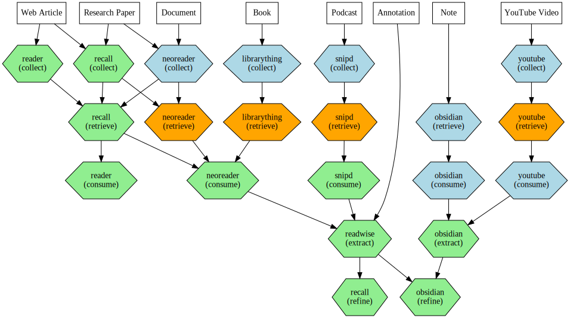
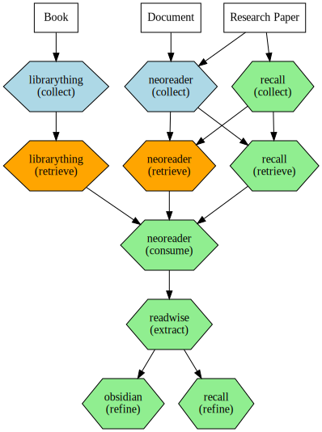

# Create graphiz visualisation


<!-- WARNING: THIS FILE WAS AUTOGENERATED! DO NOT EDIT! -->

## Creating some instances for testing

``` python
tools_from_code()
informationitems_from_code()
```

``` python
tools_inst = Tool.get_instances()
items_inst = InformationItem.get_instances()
```

``` python
tools_inst
```

    {'reader': Tool(id=101, name='Reader', organization_system=[<OrganizationSystem.TAGS: 'tags'>], phase_quality=PhaseQualityData(collect=<PhaseQuality.GREAT: 'great'>, retrieve=<PhaseQuality.BAD: 'bad'>, consume=<PhaseQuality.GREAT: 'great'>, extract=<PhaseQuality.NA: 'na'>, refine=<PhaseQuality.NA: 'na'>), collect=None, retrieve=None, consume=None, extract=None, refine=None, slug='reader'),
     'recall': Tool(id=102, name='Recall', organization_system=[<OrganizationSystem.LINKS: 'links'>], phase_quality=PhaseQualityData(collect=<PhaseQuality.GREAT: 'great'>, retrieve=<PhaseQuality.GREAT: 'great'>, consume=<PhaseQuality.NA: 'na'>, extract=<PhaseQuality.NA: 'na'>, refine=<PhaseQuality.GREAT: 'great'>), collect=None, retrieve=None, consume=None, extract=None, refine=None, slug='recall'),
     'readwise': Tool(id=103, name='Readwise', organization_system=[<OrganizationSystem.TAGS: 'tags'>], phase_quality=PhaseQualityData(collect=<PhaseQuality.NA: 'na'>, retrieve=<PhaseQuality.OK: 'ok'>, consume=<PhaseQuality.NA: 'na'>, extract=<PhaseQuality.GREAT: 'great'>, refine=<PhaseQuality.OK: 'ok'>), collect=None, retrieve=None, consume=None, extract=None, refine=None, slug='readwise'),
     'obsidian': Tool(id=104, name='Obsidian', organization_system=[<OrganizationSystem.JOHNNY_DECIMAL: 'johnny_decimal'>, <OrganizationSystem.LINKS: 'links'>], phase_quality=PhaseQualityData(collect=<PhaseQuality.NA: 'na'>, retrieve=<PhaseQuality.OK: 'ok'>, consume=<PhaseQuality.OK: 'ok'>, extract=<PhaseQuality.GREAT: 'great'>, refine=<PhaseQuality.GREAT: 'great'>), collect=None, retrieve=None, consume=None, extract=None, refine=None, slug='obsidian'),
     'librarything': Tool(id=105, name='LibraryThing', organization_system=[<OrganizationSystem.TAGS: 'tags'>], phase_quality=PhaseQualityData(collect=<PhaseQuality.OK: 'ok'>, retrieve=<PhaseQuality.BAD: 'bad'>, consume=<PhaseQuality.NA: 'na'>, extract=<PhaseQuality.NA: 'na'>, refine=<PhaseQuality.NA: 'na'>), collect=None, retrieve=None, consume=None, extract=None, refine=None, slug='librarything'),
     'snipd': Tool(id=106, name='Snipd', organization_system=[<OrganizationSystem.FOLDERS: 'folders'>], phase_quality=PhaseQualityData(collect=<PhaseQuality.OK: 'ok'>, retrieve=<PhaseQuality.BAD: 'bad'>, consume=<PhaseQuality.GREAT: 'great'>, extract=<PhaseQuality.NA: 'na'>, refine=<PhaseQuality.NA: 'na'>), collect=None, retrieve=None, consume=None, extract=None, refine=None, slug='snipd'),
     'neoreader': Tool(id=107, name='NeoReader', organization_system=[<OrganizationSystem.FOLDERS: 'folders'>], phase_quality=PhaseQualityData(collect=<PhaseQuality.OK: 'ok'>, retrieve=<PhaseQuality.BAD: 'bad'>, consume=<PhaseQuality.GREAT: 'great'>, extract=<PhaseQuality.NA: 'na'>, refine=<PhaseQuality.NA: 'na'>), collect=None, retrieve=None, consume=None, extract=None, refine=None, slug='neoreader'),
     'youtube': Tool(id=108, name='YouTube', organization_system=[<OrganizationSystem.FOLDERS: 'folders'>], phase_quality=PhaseQualityData(collect=<PhaseQuality.OK: 'ok'>, retrieve=<PhaseQuality.BAD: 'bad'>, consume=<PhaseQuality.OK: 'ok'>, extract=<PhaseQuality.NA: 'na'>, refine=<PhaseQuality.NA: 'na'>), collect=None, retrieve=None, consume=None, extract=None, refine=None, slug='youtube')}

``` python
items_inst
```

    {'web_article': InformationItem(id=209, name='Web Article', info_type=<InformationType.WEB_ARTICLE: 'web_article'>, method=PhaseMethodData(collect=<Method.MANUAL: 'manual'>, retrieve=None, consume=None, extract=None, refine=None), toolflow=PhaseToolflowData(collect=('reader', 'recall'), retrieve='recall', consume='reader', extract=None, refine=None), slug='web_article'),
     'annotation': InformationItem(id=202, name='Annotation', info_type=<InformationType.ANNOTATION: 'annotations&highlights'>, method=PhaseMethodData(collect=<Method.AUTOMATIC: 'automatic'>, retrieve=None, consume=None, extract=None, refine=None), toolflow=PhaseToolflowData(collect=None, retrieve=None, consume=None, extract='readwise', refine=('recall', 'obsidian')), slug='annotation'),
     'note': InformationItem(id=203, name='Note', info_type=<InformationType.NOTE: 'note'>, method=PhaseMethodData(collect=<Method.MANUAL: 'manual'>, retrieve=None, consume=None, extract=None, refine=None), toolflow=PhaseToolflowData(collect=None, retrieve='obsidian', consume='obsidian', extract='obsidian', refine='obsidian'), slug='note'),
     'book': InformationItem(id=204, name='Book', info_type=<InformationType.BOOK: 'book'>, method=PhaseMethodData(collect=<Method.MANUAL: 'manual'>, retrieve=None, consume=None, extract=None, refine=None), toolflow=PhaseToolflowData(collect='librarything', retrieve='librarything', consume='neoreader', extract='readwise', refine='obsidian'), slug='book'),
     'podcast': InformationItem(id=205, name='Podcast', info_type=<InformationType.PODCAST: 'podcast'>, method=PhaseMethodData(collect=<Method.AUTOMATIC: 'automatic'>, retrieve=None, consume=None, extract=None, refine=None), toolflow=PhaseToolflowData(collect='snipd', retrieve='snipd', consume='snipd', extract='readwise', refine='obsidian'), slug='podcast'),
     'research_paper': InformationItem(id=206, name='Research Paper', info_type=<InformationType.RESEARCH_PAPER: 'research_paper'>, method=PhaseMethodData(collect=<Method.MANUAL: 'manual'>, retrieve=None, consume=None, extract=None, refine=None), toolflow=PhaseToolflowData(collect=('recall', 'neoreader'), retrieve=('recall', 'neoreader'), consume='neoreader', extract='readwise', refine=('obsidian', 'recall')), slug='research_paper'),
     'document': InformationItem(id=207, name='Document', info_type=<InformationType.DOCUMENT: 'document'>, method=PhaseMethodData(collect=<Method.MANUAL: 'manual'>, retrieve=None, consume=None, extract=None, refine=None), toolflow=PhaseToolflowData(collect='neoreader', retrieve='neoreader', consume='neoreader', extract='readwise', refine=('obsidian', 'recall')), slug='document'),
     'youtube_video': InformationItem(id=208, name='YouTube Video', info_type=<InformationType.YOUTUBE_VIDEO: 'youtube_video'>, method=PhaseMethodData(collect=<Method.AUTOMATIC: 'automatic'>, retrieve=None, consume=None, extract=None, refine=None), toolflow=PhaseToolflowData(collect='youtube', retrieve='youtube', consume='youtube', extract='obsidian', refine='obsidian'), slug='youtube_video')}

``` python
test_eq(len(items_inst), 8)
test(tools_inst, "reader", operator.contains)
```

## Helper functions

The function `get_items_for_tool` filters all the instances of the class
InformationItem based on which information items can be processed by the
given tool.

------------------------------------------------------------------------

<a
href="https://github.com/Hopsakee/infoflow/blob/main/infoflow/viz.py#L16"
target="_blank" style="float:right; font-size:smaller">source</a>

### get_info_items_for_tool

>  get_info_items_for_tool (tool_name:str,
>                               info_items:dict[infoflow.classdb.InformationItem
>                               ])

*Filters all the instances of the class InformationItem based on which
information items can be processed by the given tool.*

Test the
[`get_info_items_for_tool`](https://Hopsakee.github.io/infoflow/create_vizualisation.html#get_info_items_for_tool)
function.

``` python
get_info_items_for_tool('reader', items_inst)
```

    {'Web Article': InformationItem(id=209, name='Web Article', info_type=<InformationType.WEB_ARTICLE: 'web_article'>, method=PhaseMethodData(collect=<Method.MANUAL: 'manual'>, retrieve=None, consume=None, extract=None, refine=None), toolflow=PhaseToolflowData(collect=('reader', 'recall'), retrieve='recall', consume='reader', extract=None, refine=None), slug='web_article')}

## Graphiz visualisation

The function to create the workflow visualisation for the given
`info_items` and `tools`. This is done in two steps. First we use the
function
[`create_workflow_viz`](https://Hopsakee.github.io/infoflow/create_vizualisation.html#create_workflow_viz)
that functions as a wrapper around the `build_graphiz_from_instances`
function.

The
[`create_workflow_viz`](https://Hopsakee.github.io/infoflow/create_vizualisation.html#create_workflow_viz)
has two tasks:

- It makes calling the `build_graphiz_from_instances` function easier by
  assuming we want to use all instances from the
  [`Tool`](https://Hopsakee.github.io/infoflow/classes_db.html#tool) and
  [`InformationItem`](https://Hopsakee.github.io/infoflow/classes_db.html#informationitem)
  classes. If we want to use a single instance, we can pass a single
  instance of
  [`Tool`](https://Hopsakee.github.io/infoflow/classes_db.html#tool) or
  [`InformationItem`](https://Hopsakee.github.io/infoflow/classes_db.html#informationitem).
  If we want several, but not all, instances of
  [`Tool`](https://Hopsakee.github.io/infoflow/classes_db.html#tool) or
  [`InformationItem`](https://Hopsakee.github.io/infoflow/classes_db.html#informationitem),
  we can pass a dict of instances.
- It adds the option to filter the graph to be created on a single
  [`Tool`](https://Hopsakee.github.io/infoflow/classes_db.html#tool)-name.
  If the parameter `tool_filter` is used, the function calls the
  [`get_info_items_for_tool`](https://Hopsakee.github.io/infoflow/create_vizualisation.html#get_info_items_for_tool)
  function and filters the needed
  [`InformationItem`](https://Hopsakee.github.io/infoflow/classes_db.html#informationitem)
  instances based on that tool. This way only those parts of the graph
  will be drawn that we want to see.

------------------------------------------------------------------------

<a
href="https://github.com/Hopsakee/infoflow/blob/main/infoflow/viz.py#L38"
target="_blank" style="float:right; font-size:smaller">source</a>

### build_graphiz_from_intances

>  build_graphiz_from_intances (info_items, tools)

*Create a graphviz visualisation using the updated dataclasses for
InformationItem and Tool. Produces the same layout as
build_graphiz_from_instances.*

------------------------------------------------------------------------

<a
href="https://github.com/Hopsakee/infoflow/blob/main/infoflow/viz.py#L110"
target="_blank" style="float:right; font-size:smaller">source</a>

### create_workflow_viz

>  create_workflow_viz (items:infoflow.classdb.InformationItem|dict[str,info
>                           flow.classdb.InformationItem], tools:infoflow.classd
>                           b.Tool|dict[str,infoflow.classdb.Tool],
>                           tool_filter:None|str=None)

*Create workflow visualization with flexible filtering options.*

``` python
Tool.get_instances()
```

    {'reader': Tool(id=101, name='Reader', organization_system=[<OrganizationSystem.TAGS: 'tags'>], phase_quality=PhaseQualityData(collect=<PhaseQuality.GREAT: 'great'>, retrieve=<PhaseQuality.BAD: 'bad'>, consume=<PhaseQuality.GREAT: 'great'>, extract=<PhaseQuality.NA: 'na'>, refine=<PhaseQuality.NA: 'na'>), collect=None, retrieve=None, consume=None, extract=None, refine=None, slug='reader'),
     'recall': Tool(id=102, name='Recall', organization_system=[<OrganizationSystem.LINKS: 'links'>], phase_quality=PhaseQualityData(collect=<PhaseQuality.GREAT: 'great'>, retrieve=<PhaseQuality.GREAT: 'great'>, consume=<PhaseQuality.NA: 'na'>, extract=<PhaseQuality.NA: 'na'>, refine=<PhaseQuality.GREAT: 'great'>), collect=None, retrieve=None, consume=None, extract=None, refine=None, slug='recall'),
     'readwise': Tool(id=103, name='Readwise', organization_system=[<OrganizationSystem.TAGS: 'tags'>], phase_quality=PhaseQualityData(collect=<PhaseQuality.NA: 'na'>, retrieve=<PhaseQuality.OK: 'ok'>, consume=<PhaseQuality.NA: 'na'>, extract=<PhaseQuality.GREAT: 'great'>, refine=<PhaseQuality.OK: 'ok'>), collect=None, retrieve=None, consume=None, extract=None, refine=None, slug='readwise'),
     'obsidian': Tool(id=104, name='Obsidian', organization_system=[<OrganizationSystem.JOHNNY_DECIMAL: 'johnny_decimal'>, <OrganizationSystem.LINKS: 'links'>], phase_quality=PhaseQualityData(collect=<PhaseQuality.NA: 'na'>, retrieve=<PhaseQuality.OK: 'ok'>, consume=<PhaseQuality.OK: 'ok'>, extract=<PhaseQuality.GREAT: 'great'>, refine=<PhaseQuality.GREAT: 'great'>), collect=None, retrieve=None, consume=None, extract=None, refine=None, slug='obsidian'),
     'librarything': Tool(id=105, name='LibraryThing', organization_system=[<OrganizationSystem.TAGS: 'tags'>], phase_quality=PhaseQualityData(collect=<PhaseQuality.OK: 'ok'>, retrieve=<PhaseQuality.BAD: 'bad'>, consume=<PhaseQuality.NA: 'na'>, extract=<PhaseQuality.NA: 'na'>, refine=<PhaseQuality.NA: 'na'>), collect=None, retrieve=None, consume=None, extract=None, refine=None, slug='librarything'),
     'snipd': Tool(id=106, name='Snipd', organization_system=[<OrganizationSystem.FOLDERS: 'folders'>], phase_quality=PhaseQualityData(collect=<PhaseQuality.OK: 'ok'>, retrieve=<PhaseQuality.BAD: 'bad'>, consume=<PhaseQuality.GREAT: 'great'>, extract=<PhaseQuality.NA: 'na'>, refine=<PhaseQuality.NA: 'na'>), collect=None, retrieve=None, consume=None, extract=None, refine=None, slug='snipd'),
     'neoreader': Tool(id=107, name='NeoReader', organization_system=[<OrganizationSystem.FOLDERS: 'folders'>], phase_quality=PhaseQualityData(collect=<PhaseQuality.OK: 'ok'>, retrieve=<PhaseQuality.BAD: 'bad'>, consume=<PhaseQuality.GREAT: 'great'>, extract=<PhaseQuality.NA: 'na'>, refine=<PhaseQuality.NA: 'na'>), collect=None, retrieve=None, consume=None, extract=None, refine=None, slug='neoreader'),
     'youtube': Tool(id=108, name='YouTube', organization_system=[<OrganizationSystem.FOLDERS: 'folders'>], phase_quality=PhaseQualityData(collect=<PhaseQuality.OK: 'ok'>, retrieve=<PhaseQuality.BAD: 'bad'>, consume=<PhaseQuality.OK: 'ok'>, extract=<PhaseQuality.NA: 'na'>, refine=<PhaseQuality.NA: 'na'>), collect=None, retrieve=None, consume=None, extract=None, refine=None, slug='youtube')}

An example for creating the actual visualisation for the given
`info_items` and `tools`.

``` python
viz = create_workflow_viz(items_inst, tools_inst)
type(viz)
```

    graphviz.graphs.Digraph

``` python
viz
```



``` python
viz_document = create_workflow_viz(items_inst['research_paper'], tools_inst)
viz_document
```


``` python
viz_tool = create_workflow_viz(items_inst, tools_inst, tool_filter='neoreader')
viz_tool
```



To get the `SVG` output, you can use the `_repr_image_svg_xml` method of
the `Digraph` object. Below is an example showing the first 200
characters.

``` python
print(viz._repr_image_svg_xml()[:600])
```

    <?xml version="1.0" encoding="UTF-8" standalone="no"?>
    <!DOCTYPE svg PUBLIC "-//W3C//DTD SVG 1.1//EN"
     "http://www.w3.org/Graphics/SVG/1.1/DTD/svg11.dtd">
    <!-- Generated by graphviz version 2.43.0 (0)
     -->
    <!-- Title: %3 Pages: 1 -->
    <svg width="956pt" height="534pt"
     viewBox="0.00 0.00 956.04 534.27" xmlns="http://www.w3.org/2000/svg" xmlns:xlink="http://www.w3.org/1999/xlink">
    <g id="graph0" class="graph" transform="scale(1 1) rotate(0) translate(4 530.27)">
    <title>%3</title>
    <!-- reader_collect -->
    <g id="node1" class="node">
    <title>reader_collect</title>
    <polygon fill="lightgreen" stroke="
